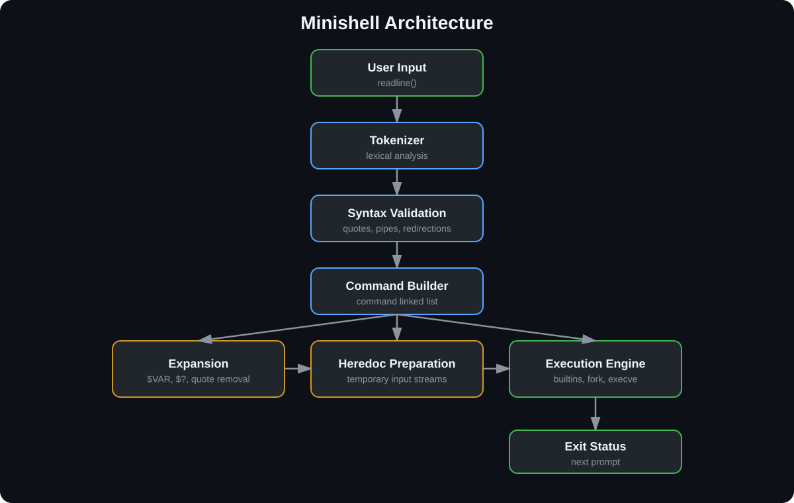
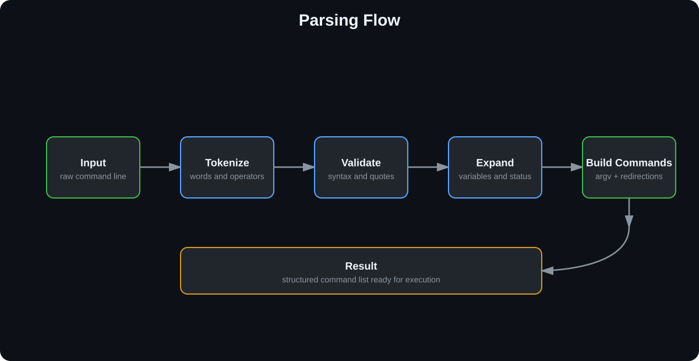
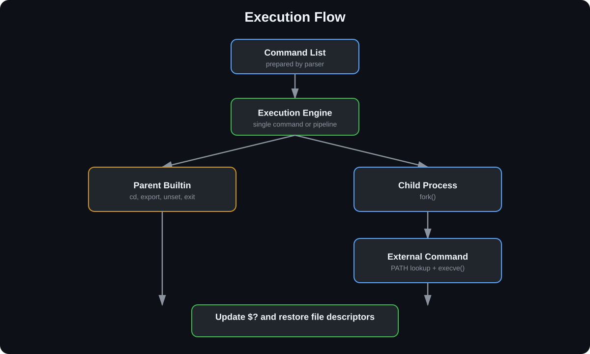
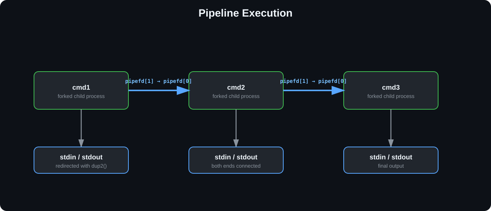
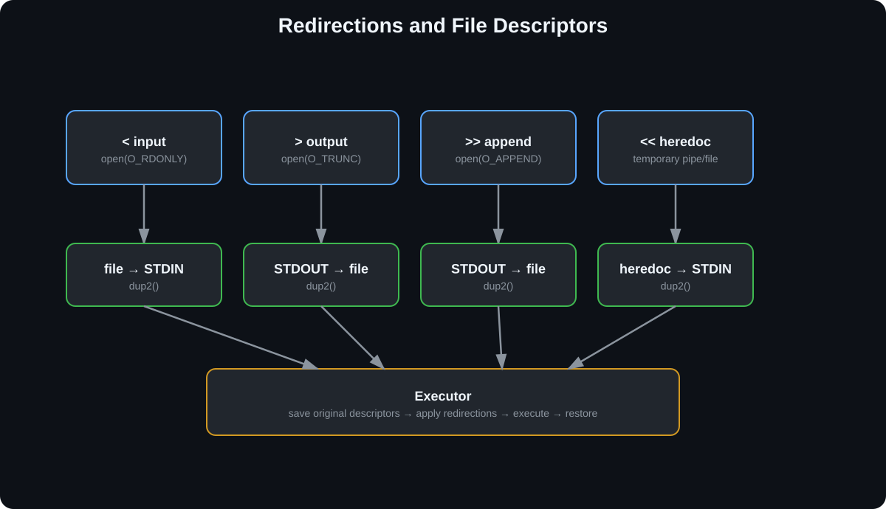
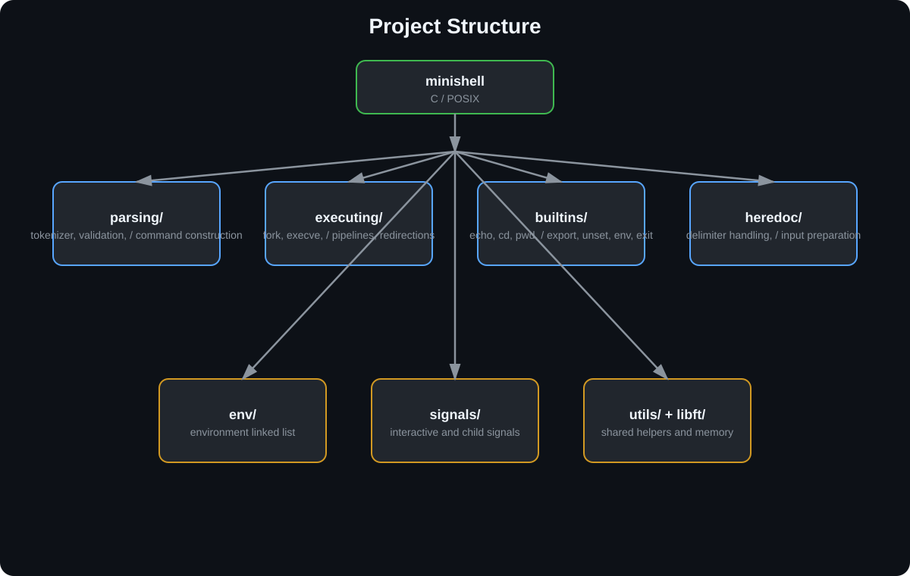

*This project has been created as part of the 42 curriculum by <rabdolho> and <pmoser>.*

# Description

Minishell is a simplified implementation of the Bash shell developed as part of the 42 curriculum.

The objective of the project is to understand how a Unix shell works internally by implementing:

- lexical analysis and parsing
- environment variable expansion
- process creation with `fork()`
- program execution with `execve()`
- pipes and file descriptor management
- redirections and heredocs
- signal handling
- built-in commands

The implementation follows Bash behavior as closely as possible within the mandatory scope of the project.

---

# Features

✅ Interactive shell using GNU Readline

✅ Interactive & non-interactive mode

✅ Tokenization

✅ Syntax validation

✅ Quote handling

✅ Variable expansion (`$VAR`, `$?`)

✅ Builtins

- echo
- cd
- pwd
- export
- unset
- env
- exit

✅ Input / Output Redirections

✅ Heredoc (`<<`)

✅ Multiple pipelines

✅ PATH lookup

✅ Signal handling

✅ Environment management

✅ Exit status propagation

✅ Memory leak free cleanup

---

# Architecture

```text
             User Input
                  │
                  ▼
            Tokenization
                  │
                  ▼
          Syntax Validation
                  │
                  ▼
         Command Construction
                  │
                  ▼
     Variable Expansion / Quotes
                  │
                  ▼
        Heredoc Preparation
                  │
                  ▼
        Execution Engine
         │              │
         ▼              ▼
 Builtins         External Commands
         │              │
         └──────┬───────┘
                ▼
          Exit Status
```

---

<p align="center">
  
</p>

## Parsing Flow

<p align="center">
  
</p>

## Execution Flow

<p align="center">
  
</p>

## Pipelines

<p align="center">
  
</p>

## Redirections

<p align="center">
  
</p>

## Project Structure

<p align="center">
  
</p>


# Instructions

## Requirements

- CC
- GNU Make
- GNU Readline

### Ubuntu

```bash
sudo apt install build-essential libreadline-dev
```

### Build

```bash
make
```

### Run

```bash
./minishell
```

### Clean

```bash
make clean
make fclean
make re
```

---

# Example

```bash
$ ./minishell

minishell$ export NAME=42

minishell$ echo $NAME
42

minishell$ cat file | grep txt | wc -l

minishell$ cat << EOF
hello
EOF

minishell$ exit
```

---

# Project Structure

```text
env/
signals/
utils/
libft/

src/
 ├── parsing/
 ├── builtins/
 ├── executing/
 └── heredoc_preparation/
```

---

# Technical Highlights

- Linked-list based environment management
- Modular parser
- Separate execution paths for builtins and external commands
- Parent/child signal separation
- Dedicated heredoc preparation phase
- Multiple pipeline support
- Correct file descriptor restoration
- Extensive edge-case handling
- Robust cleanup strategy

---

## Resources
* <a href="https://www.gnu.org/software/bash/manual/bash.html?utm_source=chatgpt.com#Shell-Syntax"> Bash Features</a>
* <a href="https://tldp.org/LDP/Bash-Beginners-Guide/html/index.html"> Bash Guide for Beginners</a>

ChatGPT was used only as a learning and documentation assistant.

It was used to:

- understand POSIX APIs;
- discuss Bash behavior and edge cases;
- review implementation ideas;
- improve documentation quality;
- write and polish the README.

The software architecture, implementation, debugging, testing, and final code were designed and validated by the project authors.
